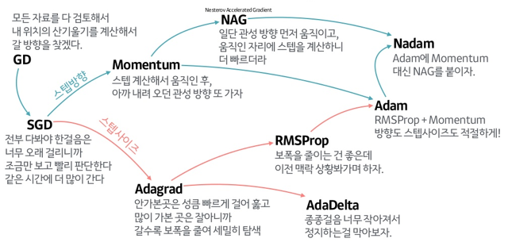

# 용어 정의
- 상태집합(S): 시스템에 있을 수 있는 상태의 집합.
- 전이행렬(T): 상태 전이 확률로 이루어진 행렬
- 대가(G): 시간 t에서 기대되는 총 보상  
$$ G_t = R_{t+1}+\gamma R_{t+2}+\gamma^2 R_{t+3}\dotsm = \sum_{k=0}^{\infty}\gamma^k R_{t+k+1}$$
- 상태가치
$$ V(s) = E[G|S_t=s] $$
- 정책
$$ \pi(a|s) = P[A_t=a|S_t=s]$$

# 손실함수

### 평균 절대 오차, MAE(Mean Absolute Error)
$$ MAE = \frac1n\sum_{i=1}^n|x_i-x|$$
 

### 평균 제곱 오차, MSE(Mean Square Error)
$$ MSE = \frac 1n \sum_{i=1}^{n}(y_i-t_i)^2 $$
회기에서 주로 사용한다.
 

### 교차 엔트로피 오차, CEE(Cross Entropy Error)
$$ CEE = -\sum_{i=1}^n(\ln(y_i)*t_i) $$

 

# Optimizer
